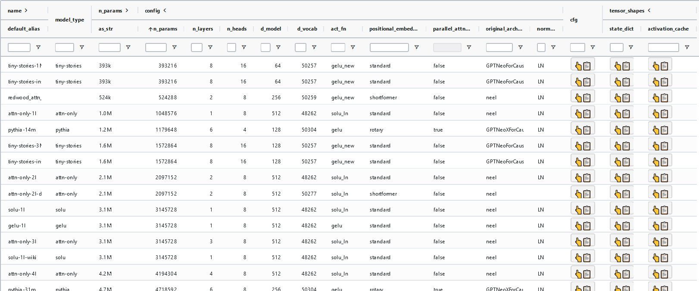
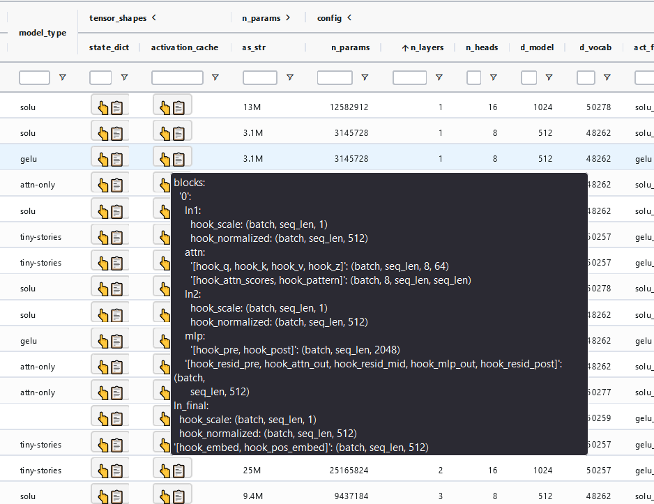

This is a utility for viewing all models available in the [TransformerLens](https://github.com/neelnanda-io/TransformerLens) package as a nice table, which you can view at [`miv.name/transformerlens-model-table/`](https://miv.name/transformerlens-model-table/).

You can also get the table as:
- [jsonlines](docs/model_table.jsonl)
- [csv](docs/model_table.csv)
- [markdown](docs/model_table.md)
- a Pandas dataframe -- see the code in [`demo.ipynb`](demo.ipynb)

The data for all of these should update daily at midnight UTC. If this appears not to have worked, or if there has been a new TransformerLens release and you want to force an update sooner, make any comment on [this issue](https://github.com/mivanit/transformerlens-model-table/issues/1) and the action should run automatically.

The tables contain:

- all model names and aliases
- model parameter counts
	- from model name
	- from (non-embedding) parameter count
	- (non-embedding) parameter count as a readable string
- model type (i.e. `gpt2`, `tiny-stories`, `pythia`, etc.)
- useful config parameters 
	- number of layers, heads, `d_model`, `d_vocab`
	- kind of: positional embeddings, activation function, normalization, etc
	- original architecture
- full model config
- shapes of all tensors in state dict, activation cache

# interactive table features:

- sort or filter by any value
- rearrange columns
- view pretty-printed tensor shapes
- for longer elements (model cfg, tensor shapes):
	- hover to view
	- left click to copy
	- right click to open as plaintext in new tab

# TODO:

 - [ ] proper CLI interface for script
 - [ ] truncated version (no config or tensor shapes) for markdown table, csv (not legible anyway)
	 - [ ] interface to choose which formats to write in
 - [ ] add config as json to jsonl data
 - [ ] make PR to TransformerLens docs