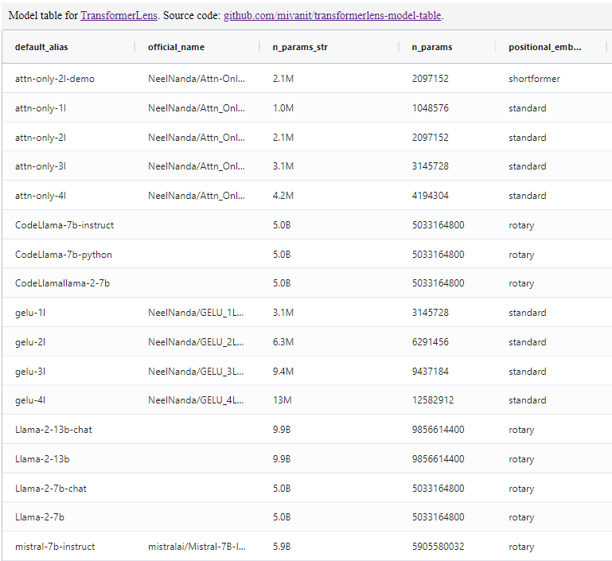

This is a utility for viewing all models available in the [TransformerLens](https://github.com/neelnanda-io/TransformerLens) package as a nice table, which you can view at [`miv.name/transformerlens-model-table/`](https://miv.name/transformerlens-model-table/).

You can also get the table as:
- [jsonlines](docs/model_table.jsonl)
- [csv](docs/model_table.csv)
- [markdown](docs/model_table.md)
- a Pandas dataframe -- see the code in [`demo.ipynb`](demo.ipynb)

The webpage should update daily at midnight UTC -- if this doesn't happen, or if a new TransformerLens version is out and you want the table updated now, make an issue.

